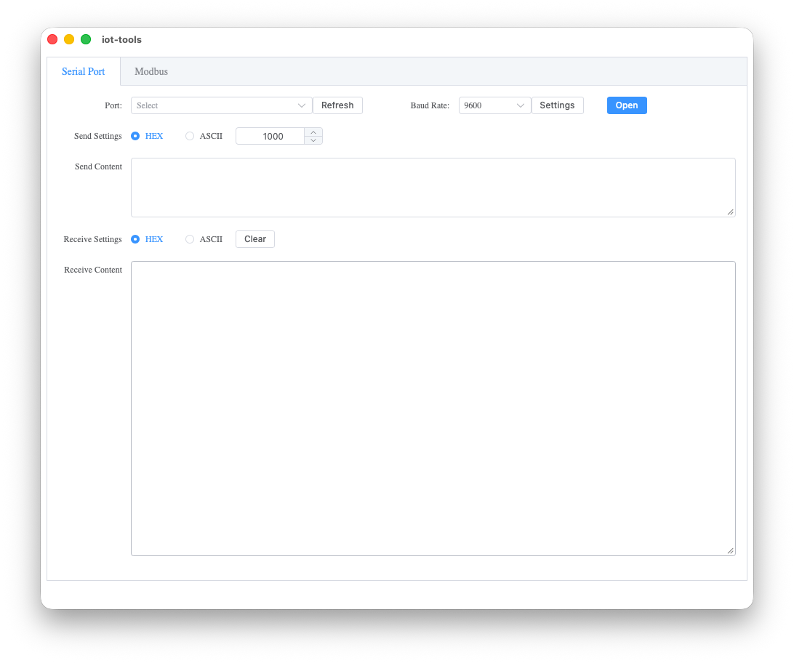
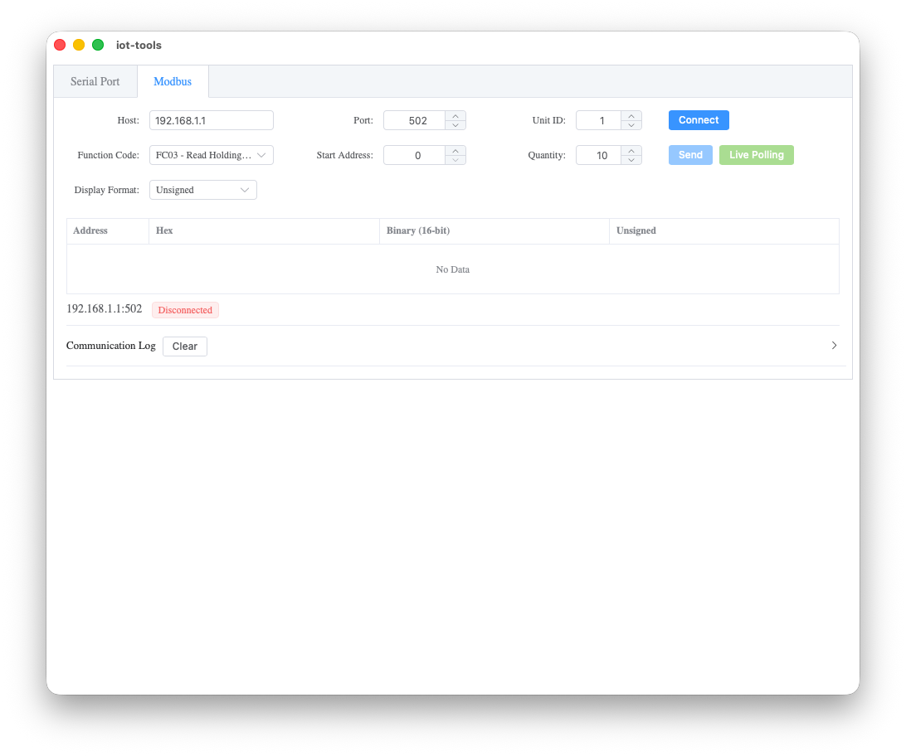
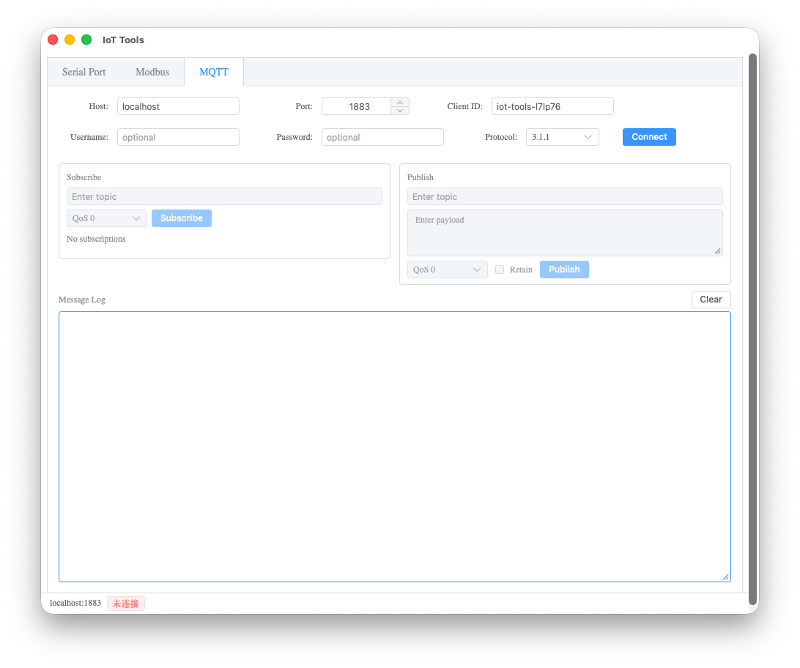

# Iot-Tools
Tauri2 + Vue3

[](https://www.rust-lang.org)
[](https://vuejs.org)
[](https://github.com/SShnoodles/iot-tools/blob/main/LICENSE)
[](https://github.com/SShnoodles/iot-tools/releases)

## Features
* [x] SerialPort
* [x] Modbus
* [ ] Mqtt

## Development
```shell
pnpm install
pnpm tauri dev
```

## Build

> Prerequisites: [Tauri prerequisites](https://tauri.app/start/prerequisites/) must be installed for your target platform.

### Windows (x86_64)

```shell
pnpm tauri build --target x86_64-pc-windows-msvc
```

Output: `src-tauri/target/x86_64-pc-windows-msvc/release/bundle/`

### Linux (x86_64)

```shell
pnpm tauri build --target x86_64-unknown-linux-gnu
```

Output: `src-tauri/target/x86_64-unknown-linux-gnu/release/bundle/`

### macOS (x86_64)

```shell
pnpm tauri build --target x86_64-apple-darwin
```

Output: `src-tauri/target/x86_64-apple-darwin/release/bundle/`

> Cross-compilation requires the corresponding Rust target to be installed first:
> ```shell
> rustup target add <target>
> ```

## Overview



